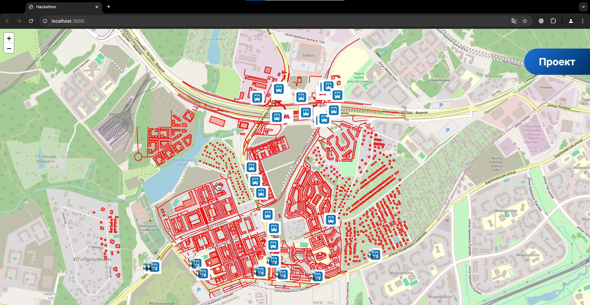

# ЦИФРОВОЙ ПРОРЫВ | ГКУ ЦОДД | ИИ-инструмент работы с данными перспективной городской застройки
Создано в рамках международного хакатона "Цифровой прорыв 2024: Сезон ИИ"

## Скриншоты сервиса

## Клиентская часть
### React

## Серверная часть
### FastAPI

## Подключённые внешние API
* OpenAI API (GPT-4o)
* OpenStreetMap API

## Планы на будущее
* Heatmap
* Настраевыемые параметры
* Улучшение системы загрузки файлов пользователем
* Учёт ширины пешеходной дорожки в контексте её пропускной способности
